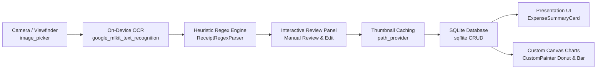

# 🧾 Expense Receipt Tracker (Flutter Mobile App)

Ứng dụng Flutter di động cao cấp phục vụ quét hóa đơn, tự động nhận diện chữ viết ngoại tuyến (**On-Device OCR**), trích xuất thông tin qua **Heuristic Regex Engine**, quản lý chi tiêu với **SQLite cục bộ** và trực quan hóa tài chính bằng **Biểu đồ Custom Canvas** thuần túy không dùng thư viện bên thứ ba.

---

## 🎯 1. Bài Toán Thực Tế (Problem Scenario & Overview)

* **Vấn đề**: Sinh viên, ban chủ nhiệm và thủ quỹ câu lạc bộ thường xuyên phải xử lý số lượng lớn hóa đơn vật lý (siêu thị, nhà sách, quán ăn, cuốc xe công nghệ, in ấn tài liệu...). Việc nhập thủ công từng con số vào bảng tính Excel rất tốn thời gian, dễ nhầm lẫn và khó theo dõi trực quan.
* **Giải pháp**: **Expense Receipt Tracker** tự động hóa 100% quy trình:
  $$\text{Chụp hóa đơn} \xrightarrow{\text{ML Kit OCR}} \text{Bóc tách thông tin} \xrightarrow{\text{Regex Engine}} \text{Lưu trữ SQLite} \xrightarrow{\text{CustomPainter}} \text{Biểu đồ trực quan}$$

---

## ✨ 2. Các Tính Năng Nổi Bật (Core Functional Specifications)

### 📸 A. Camera Capture & Image Cropping (Giao diện Khung ngắm Thông minh)
* **Live Camera Viewfinder**: Tích hợp máy ảnh phần cứng với tính năng **bật/tắt đèn Flash** và hiệu ứng **chạm lấy nét (Focus Tap Animation)** với vòng tròn định vị phản hồi thời gian thực.
* **Framing Crop Overlay**: Khung chữ nhật căn chỉnh hóa đơn với 4 góc định vị màu Neon Teal và **tia laser quét chuyển động liên tục** (Curved Animation).
* **Đa chế độ nhập liệu**: Hỗ trợ chụp ảnh trực tiếp từ máy ảnh, chọn từ thư viện ảnh hoặc chế độ **Quét hóa đơn mẫu (Demo)** phục vụ kiểm thử nhanh trên mọi nền tảng.

### 🧠 B. On-Device Text Recognition & Regex Heuristics
* **Google ML Kit Text Recognition**: Nhận diện ký tự quang học (OCR) xử lý trực tiếp trên thiết bị (On-Device), phản hồi siêu tốc (**<100ms**), hoạt động **offline 100% không cần Internet**, bảo mật dữ liệu và **0 chi phí điện toán đám mây**.
* **Bộ máy Heuristic Regex Parser tùy biến** (`ReceiptRegexParser`):
  * **Trích xuất số tiền**: Nhận diện chuẩn các định dạng tiền tệ Việt Nam (VD: `150,000 VND`, `122.000 d`, `94.000`, `68.000 đ`...).
  * **Trích xuất ngày tháng**: Tự động nhận diện chuẩn `DD/MM/YYYY` hoặc `DD-MM-YYYY`.
  * **Trích xuất đơn vị/cửa hàng**: Bóc tách tên siêu thị, chuỗi cà phê, dịch vụ di chuyển (Co.opmart, Highlands Coffee, Grab, Circle K...).
  * **Phân loại danh mục tự động**: Tự động nhận diện danh mục phù hợp (Ăn uống, Học tập, Đi lại, Thiết bị, Giải trí).
* **Interactive Review Panel**: Bảng xác nhận trực quan bên dưới khung ngắm cho phép kiểm tra, điều chỉnh số tiền, sửa tên cửa hàng, thay đổi danh mục hoặc chọn lại ngày tháng trước khi lưu vào CSDL.

### 💾 C. Local Database & Transaction Lifecycle
* **SQLite Persistent Storage** (`sqflite`): Lưu trữ dữ liệu an toàn, bền vững theo mô hình **Repository Pattern** chuẩn Clean Architecture. Hỗ trợ đầy đủ các thao tác CRUD (Thêm, Xem, Sửa, Xóa).
* **Receipt Thumbnail Caching**: Tự động sao lưu và cache ảnh chụp hóa đơn vào thư mục ứng dụng nội bộ (`ApplicationDocumentsDirectory/receipts/`) đảm bảo ảnh không bị mất khi bộ nhớ tạm của hệ điều hành bị dọn dẹp.
* **Chi tiết giao dịch tương tác**: BottomSheet hiển thị chi tiết hóa đơn, ảnh biên lai đã lưu, ghi chú và toàn bộ văn bản OCR nguyên bản.

### 📊 D. Trực Quan Hóa Canvas Độc Quyền (`CustomPainter`)
*(Hoàn toàn tự vẽ bằng Canvas API của Flutter — Không phụ thuộc bất kỳ thư viện biểu đồ thứ ba nào)*
* **Category Donut Chart** (`CategoryDonutChart`):
  * Biểu đồ tròn Donut vẽ trực tiếp trên canvas với hiệu ứng mở cung tròn hoạt họa mượt mà.
  * Hiển thị tổng ngân quỹ và phần trăm danh mục ở tâm vòng tròn.
  * Danh sách Legend tương tác: Chạm vào danh mục để làm nổi bật (highlight) cung tròn tương ứng.
* **Weekly Spending Bar Chart** (`WeeklyBarChart`):
  * Biểu đồ cột thể hiện biến động chi tiêu 7 ngày trong tuần (T2 đến CN).
  * Hiệu ứng cột mọc từ đáy với đường Baseline tinh tế.
  * **Touch-interactive Tooltip**: Chạm vào bất kỳ cột nào để hiển thị bảng thông tin chi tiết ngày và số tiền chi tiêu.

### 💳 E. In-Class Lab Exercise: `ExpenseSummaryCard`
Đáp ứng đầy đủ 4 tiêu chí bài tập với thiết kế chuẩn Material 3:
1. **Category Icon**: Nằm trong container hình tròn viền dạ quang thể hiện rõ danh mục chi tiêu.
2. **Merchant & Date**: Bố cục dọc (`Column`) với căn lề trái `CrossAxisAlignment.start`.
3. **Tiền tệ VND**: Định dạng nổi bật theo chuẩn Việt Nam (`###.### đ`).
4. **Material 3 Card**: Bo góc tròn `18.0`, độ nổi `elevation`, bọc trong `InkWell` có hiệu ứng gợn sóng không tràn viền.
5. **Receipt Attachment Indicator**: Tích hợp huy hiệu biểu tượng hóa đơn đính kèm khi giao dịch có ảnh chụp.

---

## 🏗️ 3. Kiến Trúc Hệ Thống (System Architecture)

### Sơ đồ Pipeline Xử Lý Hóa Đơn (Receipt Processing Pipeline)



### Cấu Trúc Thư Mục Chuẩn Phân Tầng (Layered Architecture)

```
lib/
├── data/
│   ├── models/
│   │   └── expense_record.dart       # Mapping bảng SQLite (to/from Map)
│   ├── repositories/
│   │   └── expense_repository.dart   # Repository Pattern (IExpenseRepository)
│   └── services/
│       ├── database_service.dart     # SQLite Database Service & In-Memory fallback
│       └── ocr_service.dart          # Google ML Kit OCR Engine (<100ms offline)
├── domain/
│   ├── models/
│   │   └── expense.dart              # Immutable Domain Model & ExpenseCategory Enum
│   └── services/
│       └── receipt_regex_parser.dart # Custom Heuristic Regex Parsing Engine
├── ui/
│   └── features/
│       ├── analytics/
│       │   └── views/
│       │       ├── analytics_view.dart        # Màn hình thống kê KPI tài chính
│       │       ├── category_donut_chart.dart  # Donut Chart vẽ bằng CustomPainter
│       │       └── weekly_bar_chart.dart      # Weekly Bar Chart vẽ bằng CustomPainter
│       ├── expenses/
│       │   ├── view_models/
│       │   │   └── expense_view_model.dart    # ViewModel quản lý danh sách chi tiêu
│       │   └── views/
│       │       ├── expense_list_screen.dart   # Màn hình danh sách & Hero Card Fintech
│       │       ├── expense_summary_card.dart  # Reusable Material 3 Card (Lab Exercise)
│       │       └── expense_summary_card_preview.dart
│       └── scan/
│           ├── view_models/
│           │   └── scan_view_model.dart       # ViewModel điều phối Pipeline quét hóa đơn
│           └── views/
│               └── scan_receipt_screen.dart   # Giao diện Viewfinder & Laser Scanning
└── main.dart                                  # Entrypoint & Theme Material 3
```

---

## 🛠️ 4. Công Nghệ & Thư Viện Sử Dụng (Tech Stack)

| Thư viện / Công nghệ | Phiên bản | Vai trò trong dự án |
| :--- | :---: | :--- |
| **Flutter SDK** | `^3.3.0` | Nền tảng phát triển ứng dụng di động đa nền tảng |
| **Dart** | `^3.13.0` | Ngôn ngữ lập trình chính, áp dụng Pattern Matching & Records |
| **google_mlkit_text_recognition** | `^0.14.0` | Nhận diện văn bản trên thiết bị (On-Device OCR, offline, 0 cloud cost) |
| **sqflite** | `^2.3.3` | Cơ sở dữ liệu SQLite cục bộ lưu trữ giao dịch bền vững |
| **image_picker** | `^1.1.2` | Tương tác máy ảnh phần cứng và thư viện ảnh |
| **path_provider** | `^2.1.4` | Định vị thư mục hệ thống để cache ảnh thumbnail hóa đơn |
| **provider** | `^6.1.2` | Quản lý trạng thái (State Management) theo kiến trúc MVVM |
| **intl** | `^0.19.0` | Định dạng tiền tệ Việt Nam (`đ`), ngày tháng và thời gian |
| **CustomPainter** | Built-in | Vẽ biểu đồ Canvas hiệu năng cao không phụ thuộc bên thứ ba |

---

## 🧪 5. Hệ Thống Kiểm Thử Tự Động (Testing & Quality Assurance)

Dự án thiết lập bộ kiểm thử toàn diện từ Unit Test, Widget Test đến luồng tích hợp E2E:

1. **Unit Tests** (`test/unit/receipt_regex_parser_test.dart`):
   * Bóc tách hóa đơn siêu thị Co.opmart chính xác (Tên, ngày, số tiền 122.000 đ, danh mục).
   * Bóc tách hóa đơn Highlands Coffee thành công.
   * Bóc tách hóa đơn cuốc xe GrabCar thành công.
   * Xử lý ngoại lệ an toàn khi ảnh mờ hoặc không có số tiền.
2. **Widget Tests** (`test/widgets/expense_summary_card_test.dart`):
   * Kiểm tra hiển thị đúng 4 tiêu chuẩn của `ExpenseSummaryCard`.
   * Kiểm tra phản hồi gợn sóng khi chạm (`InkWell onTap`).
   * Kiểm tra khả năng chống tràn bố cục (`overflow protection`).
3. **Charts Widget Tests** (`test/widgets/charts_widget_test.dart`):
   * Kiểm tra render biểu đồ Canvas `CategoryDonutChart` và tính năng chạm Legend.
   * Kiểm tra render biểu đồ Canvas `WeeklyBarChart` và tooltip tương tác.
4. **E2E Flow Test** (`test/features/scan_receipt_flow_test.dart`):
   * Kiểm thử trọn vẹn luồng người dùng: Mở máy ảnh $\rightarrow$ Bật flash $\rightarrow$ Quét hóa đơn $\rightarrow$ Nhận diện OCR $\rightarrow$ Chỉnh sửa $\rightarrow$ Lưu CSDL $\rightarrow$ Xem chi tiết $\rightarrow$ Cập nhật biểu đồ.

### Chạy kiểm thử:
```bash
# Kiểm tra phân tích cú pháp tĩnh (Static Analysis)
dart analyze

# Chạy toàn bộ bài test tự động
flutter test
```

---

## 🚀 6. Hướng Dẫn Cài Đặt & Chạy Ứng Dụng

### Bước 1: Cài đặt thư viện
```bash
flutter pub get
```

### Bước 2: Chạy ứng dụng

* **Trên Điện thoại thật (Android / iOS)**:
  * Bật chế độ **Gỡ lỗi USB (USB Debugging)** trên điện thoại và cắm cáp kết nối với máy tính.
  * Chạy lệnh:
    ```bash
    flutter run
    ```
* **Trên Trình duyệt Web (Hỗ trợ thử nghiệm nhanh)**:
  ```bash
  flutter run -d chrome
  ```
  *(Hoặc phát server mạng nội bộ: `flutter run -d web-server --web-port 8080 --web-hostname 0.0.0.0`)*.
* **Trên Máy tính Windows (Desktop)**:
  ```bash
  flutter run -d windows
  ```

---

## 👨‍💻 Tác Giả & Bản Quyền
Dự án được xây dựng và phát triển bởi **[AnBinh05](https://github.com/AnBinh05)**.
Mã nguồn mở phục vụ học tập, nghiên cứu và phát triển giải pháp quản lý tài chính thông minh.
