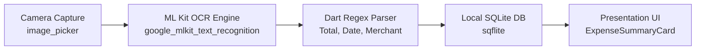

# Expense Receipt Tracker (Flutter Mobile App)

Ứng dụng Flutter di động quét hóa đơn chi tiêu tự động với nhận dạng văn bản ngoại tuyến (On-device OCR) và lưu trữ cục bộ SQLite, tuân thủ các chuẩn kỹ thuật từ bộ skills của Antigravity.

---

## 🏗️ Kiến Trúc Hệ Thống (Receipt Pipeline)



Dự án áp dụng mô hình kiến trúc chuẩn theo [flutter-apply-architecture-best-practices](file:///d:/full/.agents/skills/flutter-apply-architecture-best-practices/SKILL.md):

* **Presentation Layer (`lib/ui/`)**:
  * `ExpenseSummaryCard`: Widget Material 3 hiển thị thông tin hóa đơn (Lab Exercise).
  * `ExpenseListScreen`: Màn hình thống kê và danh sách chi tiêu.
  * `ScanReceiptScreen`: Màn hình chụp, nhận dạng chữ OCR và kiểm tra thông tin.
* **Domain Layer (`lib/domain/`)**:
  * `Expense` & `ExpenseCategory`: Domain Models bất biến.
  * `ReceiptRegexParser`: Trích xuất số tiền, ngày tháng, tên cửa hàng.
* **Data Layer (`lib/data/`)**:
  * `DatabaseService`: Kết nối và xử lý cơ sở dữ liệu SQLite (`sqflite`).
  * `OcrService`: Nhận dạng chữ ngoại tuyến bằng Google ML Kit.
  * `ExpenseRepository`: Cung cấp dữ liệu theo Repository Pattern.

---

## 🧪 Kiểm Thử (Testing)

* **Widget Tests** ([flutter-add-widget-test](file:///d:/full/.agents/skills/flutter-add-widget-test/SKILL.md)):
  ```bash
  flutter test test/widgets/expense_summary_card_test.dart
  ```
* **Unit Tests** ([dart-add-unit-test](file:///d:/full/.agents/skills/dart-add-unit-test/SKILL.md)):
  ```bash
  flutter test test/unit/receipt_regex_parser_test.dart
  ```

---

## 🚀 Hướng Dẫn Chạy Ứng Dụng

1. Tải các package phụ thuộc:
   ```bash
   flutter pub get
   ```
2. Chạy ứng dụng trên thiết bị thật hoặc máy ảo:
   ```bash
   flutter run
   ```
