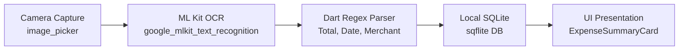

# Hướng Dẫn Thực Hiện Lab & Ứng Dụng Skills Trong Antigravity

Tài liệu này hướng dẫn chi tiết cách hoàn thành bài tập **Expense Summary Card**, xây dựng hệ thống **Receipt OCR Scanner**, và cách tận dụng tối đa bộ **Skills & Rules** của Antigravity vừa được thiết lập trong dự án.

---

## 1. Tổng Quan Kiến Trúc Dự Án (Receipt Scanner Pipeline)

Ứng dụng quét hóa đơn chi tiêu được xây dựng theo kiến trúc phân tầng chuẩn (**Presentation - Domain/Logic - Data**):



### Bản đồ kỹ năng (Skill Mapping)
| Thành phần | Công nghệ / Thư viện | Skills Antigravity áp dụng |
| :--- | :--- | :--- |
| **Giao diện Card** | Material 3, `InkWell`, `Row`/`Column` | [flutter-build-responsive-layout](file:///d:/full/.agents/skills/flutter-build-responsive-layout/SKILL.md), [flutter-fix-layout-issues](file:///d:/full/.agents/skills/flutter-fix-layout-issues/SKILL.md) |
| **Xem trước & Test Card** | Widget Preview, `flutter_test` | [flutter-add-widget-preview](file:///d:/full/.agents/skills/flutter-add-widget-preview/SKILL.md), [flutter-add-widget-test](file:///d:/full/.agents/skills/flutter-add-widget-test/SKILL.md) |
| **Bóc tách dữ liệu OCR** | Dart RegExp, Pattern Matching | [dart-use-pattern-matching](file:///d:/full/.agents/skills/dart-use-pattern-matching/SKILL.md), [dart-add-unit-test](file:///d:/full/.agents/skills/dart-add-unit-test/SKILL.md) |
| **Lưu trữ CSDL** | `sqflite`, SQLite | [flutter-implement-json-serialization](file:///d:/full/.agents/skills/flutter-implement-json-serialization/SKILL.md) |
| **Kiến trúc toàn dự án** | Repository Pattern, MVVM | [flutter-apply-architecture-best-practices](file:///d:/full/.agents/skills/flutter-apply-architecture-best-practices/SKILL.md) |
| **Tự động cập nhật UI** | Hot Reload MCP | [flutter-hot-reload.md](file:///d:/full/.agents/rules/flutter-hot-reload.md) |

---

## 2. In-Class Lab Exercise: `ExpenseSummaryCard` (30 phút)

### Yêu cầu đề bài
1. **Category Icon**: Nằm trong container hình tròn thể hiện danh mục chi tiêu.
2. **Merchant & Date**: Xếp dọc (`Column`) căn lề `CrossAxisAlignment.start`.
3. **Tiền tệ VND**: Định dạng nổi bật theo chuẩn Việt Nam (`###.### đ`).
4. **Material 3 Card**: Bo góc, elevation, bọc `InkWell` có hiệu ứng gợn sóng khi chạm.

### Mã nguồn hoàn chỉnh (`lib/widgets/expense_summary_card.dart`)

```dart
import 'package:flutter/material.dart';
import 'package:intl/intl.dart';

/// Card tóm tắt chi phí đáp ứng các tiêu chuẩn Material 3 và bố cục responsive.
class ExpenseSummaryCard extends StatelessWidget {
  final String merchant;
  final double amount;
  final DateTime date;
  final VoidCallback onTap;
  final IconData categoryIcon;
  final Color categoryColor;

  const ExpenseSummaryCard({
    super.key,
    required this.merchant,
    required this.amount,
    required this.date,
    required this.onTap,
    this.categoryIcon = Icons.receipt_long_outlined,
    this.categoryColor = Colors.teal,
  });

  /// Định dạng số tiền sang chuẩn Việt Nam Đồng (VD: 150.000 đ)
  String _formatVND(double value) {
    final formatter = NumberFormat.currency(
      locale: 'vi_VN',
      symbol: 'đ',
      decimalDigits: 0,
    );
    return formatter.format(value).trim();
  }

  @override
  Widget build(BuildContext context) {
    final theme = Theme.of(context);
    final formattedDate = DateFormat('dd/MM/yyyy').format(date);

    return Card(
      elevation: 2.0,
      margin: const EdgeInsets.symmetric(horizontal: 16.0, vertical: 8.0),
      shape: RoundedRectangleBorder(borderRadius: BorderRadius.circular(16.0)),
      clipBehavior: Clip.antiAlias, // Đảm bảo InkWell ripple không bị tràn ra ngoài góc bo
      child: InkWell(
        onTap: onTap,
        child: Padding(
          padding: const EdgeInsets.all(16.0),
          child: Row(
            children: [
              // 1. Icon bên trong circular container
              Container(
                width: 48.0,
                height: 48.0,
                decoration: BoxDecoration(
                  shape: BoxShape.circle,
                  color: categoryColor.withOpacity(0.12),
                ),
                child: Icon(categoryIcon, color: categoryColor, size: 24.0),
              ),
              const SizedBox(width: 16.0),

              // 2. Tên cửa hàng & ngày tháng xếp dọc với CrossAxisAlignment.start
              Expanded(
                child: Column(
                  crossAxisAlignment: CrossAxisAlignment.start,
                  children: [
                    Text(
                      merchant,
                      style: theme.textTheme.titleMedium?.copyWith(
                        fontWeight: FontWeight.bold,
                      ),
                      maxLines: 1,
                      overflow: TextOverflow.ellipsis,
                    ),
                    const SizedBox(height: 4.0),
                    Text(
                      formattedDate,
                      style: theme.textTheme.bodySmall?.copyWith(
                        color: theme.colorScheme.onSurfaceVariant,
                      ),
                    ),
                  ],
                ),
              ),
              const SizedBox(width: 12.0),

              // 3. Số tiền nổi bật định dạng VND
              Text(
                _formatVND(amount),
                style: theme.textTheme.titleMedium?.copyWith(
                  fontWeight: FontWeight.bold,
                  color: theme.colorScheme.primary,
                ),
              ),
            ],
          ),
        ),
      ),
    );
  }
}
```

---

## 3. Hướng Dẫn Kiểm Thử Tự Động Với Skills

### A. Kiểm thử Widget (Áp dụng `flutter-add-widget-test`)
Tạo tệp `test/widgets/expense_summary_card_test.dart`:

```dart
import 'package:flutter/material.dart';
import 'package:flutter_test/flutter_test.dart';
import 'package:your_app_name/widgets/expense_summary_card.dart';

void main() {
  testWidgets('ExpenseSummaryCard hiển thị đúng thông tin và kích hoạt onTap', (WidgetTester tester) async {
    bool wasTapped = false;
    final testDate = DateTime(2026, 10, 8);

    await tester.pumpWidget(
      MaterialApp(
        home: Scaffold(
          body: ExpenseSummaryCard(
            merchant: 'Co.opmart Cống Quỳnh',
            amount: 250000,
            date: testDate,
            onTap: () => wasTapped = true,
          ),
        ),
      ),
    );

    // Kiểm tra tên cửa hàng và ngày
    expect(find.text('Co.opmart Cống Quỳnh'), findsOneWidget);
    expect(find.text('08/10/2026'), findsOneWidget);

    // Kiểm tra định dạng tiền VND
    expect(find.textContaining('250.000'), findsOneWidget);

    // Thử tap vào Card và kiểm tra callback
    await tester.tap(find.byType(InkWell));
    await tester.pumpAndSettle();
    expect(wasTapped, isTrue);
  });
}
```

Chạy lệnh kiểm thử:
```bash
flutter test test/widgets/expense_summary_card_test.dart
```

---

## 4. Hướng Dẫn Triển Khai Dart Regex Parser Engine

Áp dụng skill [dart-use-pattern-matching](file:///d:/full/.agents/skills/dart-use-pattern-matching/SKILL.md) và [dart-add-unit-test](file:///d:/full/.agents/skills/dart-add-unit-test/SKILL.md):

```dart
/// Model kết quả trích xuất từ hóa đơn
class ParsedReceipt {
  final String? merchant;
  final double? total;
  final DateTime? date;

  ParsedReceipt({this.merchant, this.total, this.date});
}

class ReceiptRegexParser {
  /// Trích xuất tổng tiền (VND) từ văn bản OCR
  static double? extractTotal(String text) {
    // Regex tìm từ khóa như "Tổng", "Total", "Thanh toán" đi kèm số tiền
    final regex = RegExp(
      r'(?:t[ổo]ng(?:\s*ti[ềe]n)?|thanh\s*to[áa]n|total)[\s:]*([0-9]{1,3}(?:[.,][0-9]{3})*)',
      caseSensitive: false,
    );
    final match = regex.firstMatch(text);
    if (match != null) {
      final clean = match.group(1)!.replaceAll('.', '').replaceAll(',', '');
      return double.tryParse(clean);
    }
    return null;
  }

  /// Trích xuất ngày tháng dạng dd/MM/yyyy hoặc yyyy-MM-dd
  static DateTime? extractDate(String text) {
    final regex = RegExp(r'\b(\d{1,2})[/.-](\d{1,2})[/.-](\d{4})\b');
    final match = regex.firstMatch(text);
    if (match != null) {
      final day = int.parse(match.group(1)!);
      final month = int.parse(match.group(2)!);
      final year = int.parse(match.group(3)!);
      return DateTime(year, month, day);
    }
    return null;
  }
}
```

---

## 5. Danh Sách Câu Lệnh Prompt Mẫu Khi Dùng Antigravity

Khi bạn lập trình cùng Antigravity, chỉ cần gõ yêu cầu tự nhiên liên quan đến các kịch bản sau, Antigravity sẽ tự động kích hoạt skill thích hợp:

1. **Xây dựng thêm widget hoặc responsive layout:**
   > *"Tạo màn hình danh sách ExpenseListScreen sử dụng ExpenseSummaryCard, đảm bảo responsive khi xoay ngang máy tính bảng."*  
   *(Kích hoạt [flutter-build-responsive-layout](file:///d:/full/.agents/skills/flutter-build-responsive-layout/SKILL.md))*

2. **Viết test tự động:**
   > *"Hãy viết widget test cho ExpenseSummaryCard kiểm tra text overflow và format số tiền."*  
   *(Kích hoạt [flutter-add-widget-test](file:///d:/full/.agents/skills/flutter-add-widget-test/SKILL.md))*

3. **Thiết kế Database SQLite:**
   > *"Tạo service SQLite với sqflite để lưu trữ và truy vấn danh sách Expense, kèm theo hàm toMap và fromMap."*  
   *(Kích hoạt [flutter-implement-json-serialization](file:///d:/full/.agents/skills/flutter-implement-json-serialization/SKILL.md) & [flutter-apply-architecture-best-practices](file:///d:/full/.agents/skills/flutter-apply-architecture-best-practices/SKILL.md))*

4. **Sửa lỗi khi gặp thông báo ngoại lệ:**
   > *"Tôi bị lỗi RenderFlex overflowed khi nhập tên cửa hàng dài, hãy sửa giúp tôi."*  
   *(Kích hoạt [flutter-fix-layout-issues](file:///d:/full/.agents/skills/flutter-fix-layout-issues/SKILL.md))*
